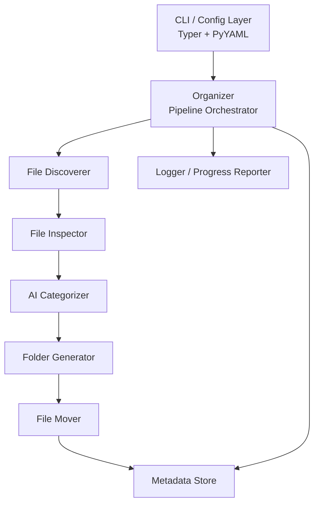

# Design Document

## Overview

The Local File Organizer is a Python command-line application that recursively scans a source directory, uses an AI model to classify each file into a category and optional subcategory, creates the required folder structure, and moves files to their destination. The system is intentionally pipeline-shaped: each stage (discover → inspect → categorize → generate folders → move) hands its output to the next, which makes the stages independently testable and allows dry-run mode to short-circuit at the move step without restructuring the logic.

### Key Design Goals

- **Correctness over speed**: Every file either reaches its destination, lands in `_review`/`_unplaced`, or is logged as skipped — no silent data loss.
- **Resumability**: The `organizer-metadata.json` store caches SHA-256 hashes and category assignments so re-runs skip already-processed files.
- **AI as a first-class dependency with graceful degradation**: When the AI model is unavailable, the system falls back to extension-based categorization rather than aborting.
- **Transparency**: A structured run-log (`organizer.log`) and dry-run mode let users verify behavior before committing to disk writes.

### Technology Choices

| Concern | Library / Tool | Rationale |
|---|---|---|
| CLI framework | [Typer](https://typer.tiangolo.com/) | Type-hint–driven argument parsing; auto-generates `--help` with types and defaults |
| Terminal output / progress | [Rich](https://rich.readthedocs.io/) | Live progress bars, styled tables, and color-coded log output in one dependency |
| PDF text extraction | [pypdf](https://pypi.org/project/pypdf/) | Pure-Python, no native deps; reliable page-level text extraction |
| Office doc extraction | [python-docx](https://pypi.org/project/python-docx/), [openpyxl](https://pypi.org/project/openpyxl/), [python-pptx](https://pypi.org/project/python-pptx/) | Standard, actively maintained per-format libraries |
| MIME type detection | [python-magic](https://github.com/ahupp/python-magic) with stdlib `mimetypes` fallback | Content-based detection (magic numbers) is more reliable than extension-only lookup |
| AI model communication | [openai](https://pypi.org/project/openai/) Python SDK with structured outputs | Well-supported SDK; structured output mode guarantees JSON schema compliance |
| Configuration | [PyYAML](https://pypi.org/project/PyYAML/) + stdlib `json` | Supports both YAML and JSON config files as required |
| Property-based testing | [Hypothesis](https://hypothesis.readthedocs.io/) | Mature, widely used PBT library for Python |

---

## Architecture

The application is structured as a linear pipeline with a shared `RunContext` object that flows through each stage. Stages communicate only through well-defined data structures and do not call each other directly — the pipeline orchestrator (`Organizer`) wires them together.



### Pipeline Stages

```
Input: source_dir, target_dir, config
      │
      ▼
┌─────────────┐
│  Discoverer │  Produces: List[DiscoveredFile]
└──────┬──────┘
       │
       ▼
┌─────────────┐
│  Inspector  │  Produces: List[InspectedFile]  (adds hash, mime, text snippet)
└──────┬──────┘
       │
       ▼
┌─────────────────┐
│  AI Categorizer │  Produces: List[CategorizedFile]  (adds category, subcategory, score)
└────────┬────────┘
         │
         ▼ [Dry Run exits here, prints report]
┌──────────────────┐
│  FolderGenerator │  Produces: List[PlacedFile]  (resolves destination paths)
└────────┬─────────┘
         │
         ▼
┌────────────────┐
│   File Mover   │  Produces: List[MoveResult]
└────────┬───────┘
         │
         ▼
┌─────────────────┐
│  MetadataStore  │  Writes organizer-metadata.json
└─────────────────┘
```

### Module Layout

```
folder_organizer/
├── __main__.py          # Entry point: python -m folder_organizer
├── cli.py               # Typer app, argument definitions, config loading
├── config.py            # Config dataclass and validation logic
├── organizer.py         # Pipeline orchestrator (Organizer class)
├── discoverer.py        # File_Discoverer: recursive enumeration, symlink handling
├── inspector.py         # File_Inspector: text extraction, hashing, MIME detection
├── categorizer.py       # AI_Categorizer: OpenAI structured outputs + fallback
├── folder_generator.py  # Folder_Generator: folder creation and name sanitization
├── file_mover.py        # File_Mover: move, conflict resolution, timestamp preservation
├── metadata_store.py    # MetadataStore: read/write/merge organizer-metadata.json
├── logger.py            # Structured logger writing to organizer.log via Rich
├── models.py            # Shared dataclasses / enums (all pipeline DTOs)
└── taxonomy.py          # Built-in category taxonomy; loaded/extended from config
```

---

## Components and Interfaces

### CLI Layer (`cli.py`)

Typer app that defines all flags and loads the config file before delegating to `Organizer`. CLI flags always override config file values.

```python
@app.command()
def organize(
    source_dir: Path = typer.Argument(..., help="Directory to organize"),
    target_dir: Optional[Path] = typer.Option(None, help="Destination root"),
    config_file: Optional[Path] = typer.Option(None, "--config", "-c"),
    exclude: List[str] = typer.Option([], "--exclude", "-e"),
    min_confidence: float = typer.Option(0.0, help="Min confidence threshold [0.0-1.0]"),
    dry_run: bool = typer.Option(False, "--dry-run"),
    ai_endpoint: Optional[str] = typer.Option(None),
    ai_model: Optional[str] = typer.Option(None),
) -> None: ...
```

Config file loading uses `ConfigLoader.load(path)` which returns a `Config` dataclass. CLI flag values are merged on top with `Config.merge_cli_overrides(...)`.

### Config (`config.py`)

```python
@dataclass
class Config:
    source_dir: Path
    target_dir: Optional[Path]
    exclude_patterns: List[str]
    min_confidence: float           # default 0.0
    dry_run: bool                   # default False
    ai_endpoint: str                # default openai chat completions endpoint
    ai_model: str                   # default "gpt-4o-mini"
    ai_api_key: Optional[str]       # read from env OPENAI_API_KEY if absent
    taxonomy: List[str]             # allowed category labels
```

`ConfigLoader` reads YAML or JSON, detects syntax errors with line/position information, and raises `ConfigParseError(path, line, message)` on failure.

### File Discoverer (`discoverer.py`)

Implements `Requirement 1` and `Requirement 2`. Uses `pathlib.Path.rglob("*")` for recursive enumeration. Symlink handling checks `path.resolve()` against `source_dir.resolve()` to detect out-of-scope links.

```python
@dataclass
class DiscoveryResult:
    discovered: List[Path]
    skipped_symlinks: int
    excluded_count: int

class FileDiscoverer:
    def discover(self, source_dir: Path, exclude_patterns: List[str]) -> DiscoveryResult: ...
```

Glob exclusion uses `fnmatch.fnmatch` against relative path strings.

### File Inspector (`inspector.py`)

Implements `Requirement 3`. Dispatches to a format-specific extractor based on MIME type, then falls back to `python-magic` content sniffing.

```python
@dataclass
class InspectedFile:
    path: Path
    sha256: str
    size_bytes: int
    mime_type: str
    extracted_text: Optional[str]      # None if unavailable
    char_count: Optional[int]          # None if unavailable
    extraction_status: ExtractionStatus  # "ok" | "unavailable" | "failed"

class FileInspector:
    def inspect(self, path: Path) -> InspectedFile: ...
```

`ExtractionStatus` is an enum: `OK`, `UNAVAILABLE`, `FAILED`.

Extractor dispatch table:

| MIME prefix / type | Extractor |
|---|---|
| `text/*` | Read raw bytes, decode as UTF-8 with `errors="replace"`, truncate to 4,096 chars |
| `application/pdf` | `pypdf.PdfReader` — extract from first 10 pages |
| `.docx` | `python-docx` — join all paragraph texts |
| `.xlsx` | `openpyxl` — join all cell values from all sheets |
| `.pptx` | `python-pptx` — join all slide text frames |
| Everything else | Status `UNAVAILABLE` |

SHA-256 is always computed over the full file content regardless of extraction outcome.

### AI Categorizer (`categorizer.py`)

Implements `Requirement 4`. Uses the OpenAI Python SDK with `response_format={"type": "json_schema", ...}` (structured outputs) to guarantee a well-formed JSON response.

```python
@dataclass
class CategorizationResult:
    category: str
    subcategory: Optional[str]
    confidence: float
    method: Literal["ai", "fallback"]
    review_required: bool
    fallback_used: bool

class AICategorizer:
    def categorize(self, file: InspectedFile, existing_record: Optional[MetadataRecord]) -> CategorizationResult: ...
    def _fallback_categorize(self, file: InspectedFile) -> CategorizationResult: ...
    def _is_valid_category(self, category: str) -> bool: ...
```

The structured output schema sent to the model:
```json
{
  "type": "object",
  "properties": {
    "category":    {"type": "string"},
    "subcategory": {"type": ["string", "null"]},
    "confidence":  {"type": "number", "minimum": 0.0, "maximum": 1.0}
  },
  "required": ["category", "subcategory", "confidence"],
  "additionalProperties": false
}
```

Duplicate detection: before calling the AI, the categorizer checks for an existing `MetadataRecord` with the same `sha256`. If found and the hash+category is not stale (Requirement 5.7), the existing result is reused.

Fallback chain:
1. AI call succeeds → use AI result, validate against taxonomy.
2. AI call fails (network / non-2xx) → `_fallback_categorize` uses extension-to-category map.
3. AI unavailable AND extension absent/unrecognized → category = `"Uncategorized"`, `review_required = True`.

### Folder Generator (`folder_generator.py`)

Implements `Requirement 6`. Sanitizes names by replacing any character not in `[A-Za-z0-9_\-. ]` with `_`. Creates folders with `Path.mkdir(parents=True, exist_ok=True)`.

```python
@dataclass
class PlacedFile:
    source_path: Path
    destination_dir: Path
    destination_filename: str   # original filename; conflict suffix added by FileMover
    review_required: bool
    unplaced: bool

class FolderGenerator:
    def resolve_placement(self, file: CategorizedFile, target_dir: Path) -> PlacedFile: ...
    def create_folders(self, placements: List[PlacedFile]) -> List[FolderCreationError]: ...
    @staticmethod
    def sanitize_name(label: str) -> str: ...
```

Files with `review_required=True` → destination is `target_dir/_review/`.
Files with folder creation failure → destination is `target_dir/_unplaced/`.

### File Mover (`file_mover.py`)

Implements `Requirement 7`. Uses `shutil.move` and restores the original mtime with `os.utime` after the move. Conflict resolution loops from suffix 1 to 9999.

```python
@dataclass
class MoveResult:
    source_path: Path
    destination_path: Optional[Path]
    success: bool
    skip_reason: Optional[str]

class FileMover:
    def move(self, placed: PlacedFile) -> MoveResult: ...
    def _resolve_conflict(self, dest_dir: Path, filename: str) -> Optional[Path]: ...
```

Dry run: `FileMover` checks a `dry_run` flag and returns a `MoveResult` with the resolved destination path but performs no I/O.

### Metadata Store (`metadata_store.py`)

Implements `Requirement 5`. Reads existing `organizer-metadata.json` at startup (if present), merges results after the run, and writes atomically via a temp file + rename.

```python
class MetadataStore:
    def load(self, target_dir: Path) -> None: ...
    def get_by_hash(self, sha256: str) -> Optional[MetadataRecord]: ...
    def get_by_path(self, path: Path) -> Optional[MetadataRecord]: ...
    def upsert(self, record: MetadataRecord) -> None: ...
    def flush(self, target_dir: Path) -> None: ...
```

The in-memory store is keyed by `original_path` (string) with a secondary index by `sha256` for deduplication lookups. `flush` writes to a temp file in the same directory and renames atomically to prevent corruption on interrupt.

### Logger / Progress Reporter (`logger.py`)

Implements `Requirement 9`. Uses `Rich`'s `Progress` for the live indicator and a `logging.FileHandler` with a structured formatter for `organizer.log`.

Log entry format (JSON-Lines):
```json
{"timestamp": "2024-01-15T10:23:45.123Z", "level": "INFO", "path": "/src/report.pdf", "action": "moved", "destination": "/target/Finance/Invoices/report.pdf"}
```

Signal handling: a `SIGINT` handler flushes the metadata store and prints a partial summary before exiting.

---

## Data Models

All models live in `models.py` and are plain Python `dataclasses`. JSON serialization uses `dataclasses.asdict` + `json.dumps`.

### MetadataRecord

```python
@dataclass
class MetadataRecord:
    original_path: str          # absolute path at time of processing
    destination_path: str       # absolute path after move (empty string if not moved)
    sha256: str                 # hex-encoded SHA-256 of full binary content
    size_bytes: int
    mime_type: str
    text_snippet: str           # up to 512 chars of extracted text
    category: str
    subcategory: Optional[str]
    confidence_score: float     # [0.0, 1.0]
    method: str                 # "ai" | "fallback"
    review_required: bool
    fallback_used: bool
    extraction_status: str      # "ok" | "unavailable" | "failed"
    timestamp: str              # ISO 8601, e.g. "2024-01-15T10:23:45Z"
```

### CategorizedFile (pipeline DTO)

```python
@dataclass
class CategorizedFile:
    path: Path
    sha256: str
    size_bytes: int
    mime_type: str
    extracted_text: Optional[str]
    char_count: Optional[int]
    extraction_status: str
    category: str
    subcategory: Optional[str]
    confidence: float
    method: str
    review_required: bool
    fallback_used: bool
```

### RunSummary

```python
@dataclass
class RunSummary:
    total_discovered: int
    total_processed: int
    total_moved: int
    total_skipped: int
    total_review: int
    total_unplaced: int
    total_errors: int
    dry_run: bool
```

### Category Taxonomy

The default built-in taxonomy (from `taxonomy.py`):

```python
DEFAULT_TAXONOMY = [
    "Documents",
    "Images",
    "Videos",
    "Audio",
    "Code",
    "Archives",
    "Finance",
    "Data",
    "Presentations",
    "Spreadsheets",
    "Executables",
    "Fonts",
    "Uncategorized",
]
```

Users can extend this list in the config file under `taxonomy`. The AI prompt includes the full list so the model is constrained to valid values.

### organizer-metadata.json Schema

```json
{
  "version": "1",
  "records": {
    "/abs/path/to/file.pdf": {
      "original_path": "/abs/path/to/file.pdf",
      "destination_path": "/target/Finance/Invoices/file.pdf",
      "sha256": "abc123...",
      "size_bytes": 204800,
      "mime_type": "application/pdf",
      "text_snippet": "Invoice #1234...",
      "category": "Finance",
      "subcategory": "Invoices",
      "confidence_score": 0.95,
      "method": "ai",
      "review_required": false,
      "fallback_used": false,
      "extraction_status": "ok",
      "timestamp": "2024-01-15T10:23:45Z"
    }
  }
}
```

---

## Correctness Properties

*A property is a characteristic or behavior that should hold true across all valid executions of a system — essentially, a formal statement about what the system should do. Properties serve as the bridge between human-readable specifications and machine-verifiable correctness guarantees.*

### Property 1: Metadata round-trip fidelity

*For any* valid `MetadataRecord`, serializing it to JSON and then deserializing it shall produce a record equal to the original.

**Validates: Requirements 5.2, 5.3**

---

### Property 2: Confidence score is always in range

*For any* file processed by the `AI_Categorizer` (whether via AI path or fallback path), the resulting `Confidence_Score` shall be a float in the range [0.0, 1.0] inclusive.

**Validates: Requirements 4.2, 4.6**

---

### Property 3: Below-threshold files are never auto-moved

*For any* configured minimum confidence threshold `t` in [0.0, 1.0], and *for any* file whose `Confidence_Score` is strictly less than `t`, the `File_Mover` shall NOT move that file to a category folder — it shall be routed to `_review` or left in place.

**Validates: Requirements 4.3, 7.5**

---

### Property 4: Duplicate files reuse existing categorization

*For any* two files with the same SHA-256 hash, if the first file has been processed and its `MetadataRecord` persisted, then categorizing the second file shall produce the same `Category`, `Subcategory`, and `Confidence_Score` as the first, without invoking the AI model again.

**Validates: Requirements 4.5, 5.5**

---

### Property 5: Conflict resolution always produces a unique destination name

*For any* destination directory and *for any* sequence of files with the same base name being moved into it (up to 9,999 files), the conflict resolver shall assign each file a unique filename (by appending `_1`, `_2`, … up to `_9999`), and no two files shall be assigned the same destination path.

**Validates: Requirements 7.2, 7.6**

---

### Property 6: Folder name sanitization is idempotent

*For any* category or subcategory label string `s`, applying the `sanitize_name` function twice shall produce the same result as applying it once: `sanitize_name(sanitize_name(s)) == sanitize_name(s)`.

**Validates: Requirements 6.3**

---

### Property 7: Metadata merge preserves existing records

*For any* existing `organizer-metadata.json` and *for any* new run that processes a disjoint set of files, merging the new records into the store shall result in a store that contains all records from both the previous run and the new run — no existing record keyed by a path not encountered in the current run shall be removed.

**Validates: Requirements 5.6**

---

### Property 8: Extraction character count is within bounds

*For any* text-based file whose content is successfully extracted, the `char_count` stored in the `Metadata_Record` shall be between 0 and 4,096 inclusive, and shall equal `len(extracted_text)`.

**Validates: Requirements 3.1, 3.7**

---

### Property 9: Dry run produces zero disk mutations

*For any* source directory and *for any* configuration with `dry_run=True`, executing the full pipeline shall result in zero files moved, zero folders created, and no `organizer-metadata.json` written — the file system state after the run shall be byte-for-byte identical to the state before the run.

**Validates: Requirements 8.1, 8.3**

---

### Property 10: Every processed file has a complete MetadataRecord

*For any* set of files discovered and processed by the Organizer, each file shall have a corresponding `MetadataRecord` in the store containing all required fields (`original_path`, `sha256`, `size_bytes`, `mime_type`, `text_snippet`, `category`, `confidence_score`, `method`, `extraction_status`, `timestamp`) with values of the correct types.

**Validates: Requirements 5.1, 5.2**

---

### Property 11: File last-modified timestamp is preserved after move

*For any* file with an arbitrary last-modified timestamp, after `File_Mover` moves it to its destination, the destination file's last-modified timestamp shall equal the original file's last-modified timestamp.

**Validates: Requirements 7.3**

---

### Property 12: Recursive enumeration discovers all files

*For any* directory tree of arbitrary depth and structure, the `FileDiscoverer` shall return a list that includes every regular file contained within the tree (excluding symbolic links and excluded paths), with no omissions.

**Validates: Requirements 2.1**

---

### Property 13: Exclusion filter removes all matching files

*For any* set of files and *for any* set of exclusion glob patterns, the `FileDiscoverer` shall return a list that contains no file whose relative path matches any of the provided patterns.

**Validates: Requirements 2.2**

---

### Property 14: Discovery count report is accurate

*For any* source directory, the counts reported by the `FileDiscoverer` (discovered, excluded, skipped symlinks) shall equal the true counts of files in each category, and their sum shall account for every path encountered during enumeration.

**Validates: Requirements 2.4**

---

### Property 15: SHA-256 hash is computed correctly

*For any* file with binary content `b`, the `sha256` field in the resulting `MetadataRecord` shall equal `hashlib.sha256(b).hexdigest()`.

**Validates: Requirements 3.5**

---

### Property 16: Every processed file is assigned a non-empty category

*For any* file processed by the `AI_Categorizer` (including all fallback paths), the resulting `category` field shall be a non-empty string and `subcategory` shall be either a non-empty string or `None`.

**Validates: Requirements 4.1**

---

### Property 17: Structured log entries contain all required fields

*For any* file processed during a run, the corresponding log entry written to `organizer.log` shall contain a valid ISO 8601 `timestamp`, a `level` value of `INFO`, `WARN`, or `ERROR`, a non-empty `path`, and a non-empty `action` or `error` description.

**Validates: Requirements 9.2, 9.5**

---

### Property 18: Run summary counts match actual operation counts

*For any* run over a known set of files with predetermined outcomes, the `RunSummary` reported at the end shall have `total_moved`, `total_skipped`, `total_review`, `total_unplaced`, and `total_errors` values that equal the actual counts of files in each outcome bucket.

**Validates: Requirements 9.3**

---

### Property 19: CLI flags override config file values

*For any* parameter present in both the config file and as a CLI flag, the effective configuration used by the Organizer shall use the CLI flag value, not the config file value.

**Validates: Requirements 10.2**

---

## Error Handling

### Error Categories and Responses

| Error Condition | Component | Response |
|---|---|---|
| Source_Directory not found / not a dir | CLI / Config | Print descriptive error, exit code 1, no file I/O |
| Target_Directory cannot be created | Organizer startup | Print descriptive error, exit code 1 |
| Config file parse error | ConfigLoader | Print path + line/position of error, exit code 1 |
| Missing required param (source_dir) | ConfigLoader | Print param name, exit code 1 |
| Directory not readable during enumeration | FileDiscoverer | Halt discovery, emit error with path and reason |
| File content read error | FileInspector | Record `extraction_status = "failed"`, continue |
| Binary / unsupported format | FileInspector | Record `extraction_status = "unavailable"`, continue |
| AI model unavailable / non-2xx | AICategorizer | Fallback to extension-based category, `fallback_used = True`, `confidence = 0.0` |
| AI returns out-of-taxonomy category | AICategorizer | Discard response, `review_required = True`, skip auto-move |
| Folder creation permission error | FolderGenerator | Log error, route file to `_unplaced` |
| File move permission / I/O error | FileMover | Log error with path and reason, skip file, continue |
| Conflict suffix exceeds 9,999 | FileMover | Log error for that file, skip it, continue |
| `organizer-metadata.json` write failure | MetadataStore | Report error, keep in-memory records, do not abort |
| SIGINT / keyboard interrupt | Organizer | Flush metadata to disk, print partial summary, exit code 130 |

### Error Exit Codes

| Code | Meaning |
|---|---|
| 0 | Successful run (errors may have been encountered per-file; see log) |
| 1 | Fatal configuration or setup error — no files were processed |
| 130 | Interrupted by user (SIGINT) |

---

## Testing Strategy

### Unit Tests

Each module has a corresponding unit test file under `tests/unit/`. Unit tests use `pytest` and focus on:
- Specific examples that demonstrate correct behavior for each component.
- Error condition handling (file not found, permission denied, etc.).
- Boundary values (empty text, max char counts, confidence boundary at threshold).
- Taxonomy validation logic in the categorizer.
- Folder name sanitization with a representative set of special characters.
- Metadata store merge logic with overlapping and disjoint record sets.
- Config loading with valid YAML, valid JSON, and intentionally malformed inputs.

AI calls in unit tests are mocked using `unittest.mock.patch`. File system operations use `tmp_path` (pytest's built-in temp directory fixture).

### Property-Based Tests

Property tests use [Hypothesis](https://hypothesis.readthedocs.io/). Each test runs a minimum of 100 iterations. Tests live in `tests/property/`.

Each test is tagged with a comment referencing its design property:
```python
# Feature: local-file-organizer, Property 1: Metadata round-trip fidelity
```

**Property 1 — Metadata round-trip fidelity**
Generate arbitrary `MetadataRecord` instances and verify `deserialize(serialize(r)) == r`.

**Property 2 — Confidence score in range**
Generate arbitrary file signals (name, extension, size, mime, text) through the categorizer (with mocked AI response returning arbitrary floats); assert `0.0 <= result.confidence <= 1.0`.

**Property 3 — Below-threshold files never auto-moved**
Generate pairs of `(threshold, confidence)` where `confidence < threshold`; assert the pipeline routes the file to `_review`, not a category folder.

**Property 4 — Duplicate file deduplication**
Generate two `InspectedFile` instances with the same `sha256`; process the first, then the second; assert the second skips the AI call and returns an identical result.

**Property 5 — Conflict resolution uniqueness**
Generate a list of files all sharing the same base name (up to 9,999) and move them into the same temp directory; assert all destination paths are distinct.

**Property 6 — Sanitize is idempotent**
Generate arbitrary Unicode strings; assert `sanitize_name(sanitize_name(s)) == sanitize_name(s)`.

**Property 7 — Metadata merge preserves records**
Generate two disjoint sets of `MetadataRecord` instances; load the first set into the store, run a simulated merge with the second set; assert all records from the first set are still present.

**Property 8 — Extraction char count bounds**
Generate arbitrary text content of varying length; assert `char_count == len(extracted_text)` and `char_count <= 4096`.

**Property 9 — Dry run produces no disk mutations**
Generate a temp directory with arbitrary file names; run the pipeline with `dry_run=True`; assert the directory tree is unchanged after the run (using directory snapshot comparison).

**Property 10 — Every processed file has a complete MetadataRecord**
Generate arbitrary sets of `InspectedFile` instances; after processing, assert every file has a record with all required fields populated with correct types.

**Property 11 — File mtime preserved after move**
Generate arbitrary files with arbitrary `mtime` values (via `os.utime`); move each file; assert `os.stat(destination).st_mtime == original_mtime`.

**Property 12 — Recursive enumeration discovers all files**
Generate arbitrary directory trees of varying depth in a temp directory; assert the discovered file list has exactly the same members as a ground-truth `os.walk` traversal.

**Property 13 — Exclusion filter removes matching files**
Generate arbitrary file path lists and glob patterns; assert no file whose relative path matches any pattern appears in the discovery result.

**Property 14 — Discovery count report is accurate**
Generate a temp directory with arbitrary files including some matching exclusion patterns; assert reported counts sum correctly to total files encountered.

**Property 15 — SHA-256 hash correctness**
Generate arbitrary bytes content; write to a temp file; assert `inspector.inspect(path).sha256 == hashlib.sha256(content).hexdigest()`.

**Property 16 — Every processed file is assigned a non-empty category**
Generate arbitrary `InspectedFile` instances through all categorizer paths (AI, fallback, uncategorized); assert `result.category` is always a non-empty string.

**Property 17 — Structured log entries contain all required fields**
Process arbitrary files; parse the log output; assert every entry has `timestamp`, `level`, `path`, and `action` fields with non-empty values.

**Property 18 — Run summary counts match actual outcomes**
Run the pipeline over a known set of files with predetermined mock outcomes; assert all `RunSummary` count fields equal the true counts.

**Property 19 — CLI flags override config file values**
Generate arbitrary `(config_value, cli_value)` pairs for each overridable parameter; assert the merged `Config` uses `cli_value` for every parameter that was provided via CLI.

### Integration Tests

Integration tests under `tests/integration/` verify end-to-end behavior with real file I/O against a temp directory:
- Full pipeline with a synthetic directory of mixed file types.
- Metadata persistence and reload across two sequential runs.
- AI service mocked via `responses` library to simulate success, failure, and invalid taxonomy responses.
- Dry run against a populated directory — assert zero mutations.
- SIGINT simulation — assert partial metadata flush.
